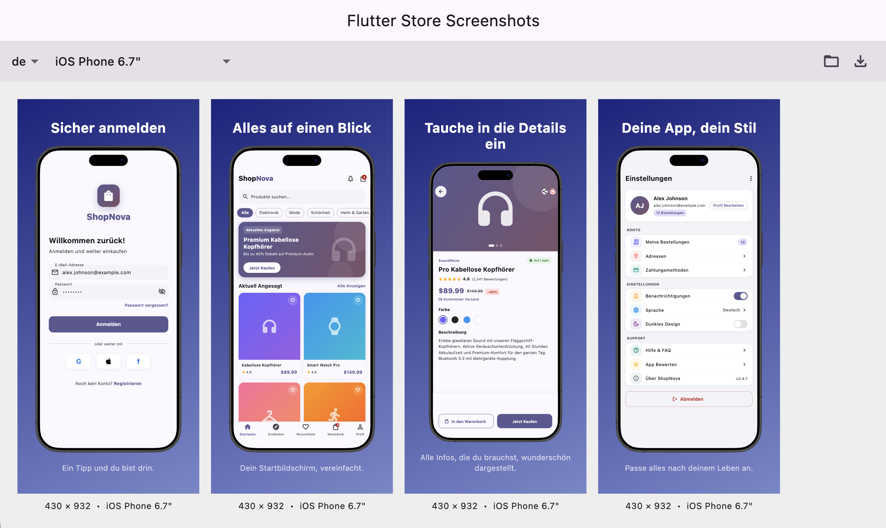

# Flutter Store Screenshots



Compose, preview, and export App Store & Google Play screenshots from a single Flutter app — with localisation support, device frames, and one-click bulk export.

This package helps you create beautiful screenshots for stores like the App and Play Store, using the technique/framework you already know, FLUTTER!

Instead of having to learn a new tool, or setup complicated UI automation tests, you simply use what you already have to build your screenshots. Because this package uses your app's actual widgets, updating is as simple as regenerating the screenshots.

---

## Installation

Create a dedicated screenshot app (e.g. `store_screenshots/`) and add the dependency:

```yaml
dependencies:
  flutter_store_screenshots: ^0.2.0
  my_app:
    path: ../my_app  # import your app's widgets and localisation
```

---

## Quick start

```dart
import 'package:device_frame/device_frame.dart';
import 'package:flutter/material.dart';
import 'package:flutter_store_screenshots/flutter_store_screenshots.dart';

void main() {
  runApp(
    FlutterStoreScreenshotsApp(
      locales: const [Locale('en'), Locale('de')],
      localizationsDelegates: const [AppLocalizations.delegate],
      screenshotSets: [
        AppleScreenshotSet.iPhone67(
          storeScreenshots: [
            StoreScreenshot(
              name: 'home',
              builder: framedCanvas(
                device: Devices.ios.iPhone16ProMax,
                child: (_) => const HomeScreen(),
                title: (ctx) => AppLocalizations.of(ctx).screenshotHomeTitle,
              ),
            ),
          ],
        ),
      ],
    ),
  );
}
```

Run on macOS to preview live:

```bash
flutter run -d macos
```

Click **↓** in the toolbar to export. Files land in `screenshots/<set>/<locale>/01_home.png`.

---

## Core concepts

### `StoreScreenshot`

The `builder` owns the **full screenshot canvas** — background, text, device frame, everything. Use the built-in canvas helpers or build it yourself.

```dart
StoreScreenshot(
  name: 'home',
  builder: framedCanvas(
    device: Devices.ios.iPhone16ProMax,
    child: (_) => const HomeScreen(),
    title: (ctx) => AppLocalizations.of(ctx).homeTitle,
    subtitle: (ctx) => AppLocalizations.of(ctx).homeSubtitle,
  ),
)
```

Only `builder` is required. `name`, `locale`, `size`, `pixelDensity`, `theme`, `targetPlatform`, and `captureDelay` are all optional and inherited from the parent `ScreenshotSet` when not set.

### `ScreenshotContent`

Use `ScreenshotContent` when building a canvas manually — it wraps your app screen in a fresh `Navigator` so no back button appears in `AppBar`s:

```dart
StoreScreenshot(
  name: 'home',
  builder: (context) => Stack(
    children: [
      const MyBackground(),
      Center(
        child: DeviceFrame(
          device: Devices.ios.iPhone16ProMax,
          screen: ScreenshotContent(builder: (_) => const HomeScreen()),
        ),
      ),
    ],
  ),
)
```

### `ScreenshotSet`

Groups screenshots that share a canvas size and platform. Use the preset subclasses or construct one directly. Settings here serve as defaults for every `StoreScreenshot` in the set.

---

## Preset sets

### `AppleScreenshotSet`

| Constructor | Output size | Store target |
|---|---|---|
| `.iPhone69(...)` | 1320 × 2868 px | App Store 6.9" iPhone |
| `.iPhone67(...)` | 1290 × 2796 px | App Store 6.7" iPhone |
| `.iPadPro129(...)` | 2048 × 2732 px | App Store iPad Pro 12.9" |

### `AndroidScreenshotSet`

| Constructor | Output size | Store target |
|---|---|---|
| `.phone(...)` | ≈1081 × 2341 px | Google Play phone |
| `.tablet7(...)` | 1200 × 1920 px | Google Play 7" tablet |
| `.tablet10(...)` | 1600 × 2560 px | Google Play 10" tablet |
| `.featureGraphic(...)` | 1024 × 500 px | Google Play Feature Graphic |

Each preset sets `size`, `pixelDensity`, and `targetPlatform` automatically. Only `storeScreenshots` is required (plus an optional `captureDelay`).

---

## Built-in canvas helpers

### `framedCanvas`

Returns a `WidgetBuilder` for use as `StoreScreenshot.builder`. Renders a gradient background, a `DeviceFrame` in the centre, and optional marketing text above/below.

```dart
builder: framedCanvas(
  device: Devices.ios.iPhone16ProMax,
  child: (_) => const HomeScreen(),
  title: (ctx) => AppLocalizations.of(ctx).homeTitle,
  subtitle: (ctx) => AppLocalizations.of(ctx).homeSubtitle,
  gradient: const LinearGradient(colors: [Color(0xFF1A237E), Color(0xFF7986CB)]),
)
```

### `featureGraphicCanvas`

For the Google Play Feature Graphic (1024×500 px). Text on the left, device mockup on the right.

```dart
AndroidScreenshotSet.featureGraphic(
  storeScreenshots: [
    StoreScreenshot(
      name: 'feature_graphic',
      builder: featureGraphicCanvas(
        child: (_) => const HomeScreen(),
        title: (ctx) => AppLocalizations.of(ctx).featureTitle,
        subtitle: (ctx) => AppLocalizations.of(ctx).featureSubtitle,
      ),
    ),
  ],
)
```

### `panoramicCanvas`

Splits a wide layout across multiple consecutive screenshots that form a seamless panorama. Returns a `List<StoreScreenshot>`.

```dart
AppleScreenshotSet.iPhone67(
  storeScreenshots: panoramicCanvas(
    count: 3,
    names: ['discover', 'track', 'share'],
    panoramaBuilder: (context) {
      final w = MediaQuery.sizeOf(context).width; // full combined width
      return Row(
        children: [
          SizedBox(width: w / 3, child: const DiscoverScreen()),
          SizedBox(width: w / 3, child: const TrackScreen()),
          SizedBox(width: w / 3, child: const ShareScreen()),
        ],
      );
    },
  ),
)
```

---

## `captureDelay`

Set on a `ScreenshotSet` or individual `StoreScreenshot` to wait before capturing. Useful when screens have animations or network images that need time to settle:

```dart
StoreScreenshot(
  name: 'home',
  captureDelay: const Duration(milliseconds: 800),
  builder: framedCanvas(
    device: Devices.ios.iPhone16ProMax,
    child: (_) => const HomeScreen(),
  ),
)
```

> The export runs entirely on the Flutter rendering engine — no external tools, simulators, or screenshot drivers required.

---

## Config inheritance cheat-sheet

Values are resolved in this order (first non-null wins):

```
StoreScreenshot  →  ScreenshotSet  →  FlutterStoreScreenshotsApp
```

For example, `pixelDensity`:

1. `StoreScreenshot.pixelDensity`
2. `ScreenshotSet.pixelDensity`
3. Falls back to `1.0`

For `locale`:

1. `StoreScreenshot.locale`
2. `ScreenshotSet.locale`
3. The locale currently selected in the toolbar dropdown

---

## Tips

**Reuse the same screens for every device** — define your screenshots once and pass the list to multiple preset sets:

```dart
List<StoreScreenshot> _myScreenshots() => [
  StoreScreenshot(name: 'home', builder: (_) => const HomeScreen()),
  StoreScreenshot(name: 'detail', builder: (_) => const DetailScreen()),
];

screenshotSets: [
  AppleScreenshotSet.iPhone67(decorator: myDecorator, storeScreenshots: _myScreenshots()),
  AppleScreenshotSet.iPadPro129(decorator: myDecorator, storeScreenshots: _myScreenshots()),
  AndroidScreenshotSet.phone(decorator: myDecorator, storeScreenshots: _myScreenshots()),
],
```

**Google Play Feature Graphic** — use `AndroidScreenshotSet.featureGraphic` with the built-in `featureGraphicDecorator` for an instant branding layout (text left, device right):

```dart
AndroidScreenshotSet.featureGraphic(
  decorator: featureGraphicDecorator(),
  storeScreenshots: [
    StoreScreenshot(
      name: 'feature_graphic',
      titleBuilder: (_) => 'My App',
      subtitleBuilder: (ctx) => AppLocalizations.of(ctx).featureTagline,
      builder: (_) => const HomeScreen(),
    ),
  ],
),
```

**Force a specific locale for a set** — useful when your Play Console submission requires the screenshots to be in a fixed language regardless of the toolbar selection:

```dart
ScreenshotSet(
  name: 'iOS Phone 6.7" (EN)',
  locale: const Locale('en'),
  ...
),
```

---

## Additional information

- File issues and feature requests on [GitHub](https://github.com/SEGVeenstra/flutter_store_screenshots/issues).
- Contributions are welcome — please open an issue first to discuss larger changes.
- See the [`example/`](example/) folder for a full working project with four screens, four locales, and five screenshot sets including a Google Play Feature Graphic.
